# Unix & Linux 大学教程

## 目录

[TOC]

第1章unix简介
第2章什么是linux?什么是unix
第3章unix连接
第4章开始使用unix
第5章gui：图形用户界面
第6章unix工作环境
第7章unix键盘使用
第8章能够立即使用的程序
第9章文档资料：unix手册与info
第10章命令语法
第11章shell
第12章使用shell：变量和选项
第13章使用shell：命令和定制 251
第14章使用shell：初始化文件 292
第15章标准i／o：重定向和管道  310
第16章过滤器：简介和基本操作 336
第17章过滤器：比较和抽取 356
第18章过滤器：统计和格式化 379
第19章过滤器：选取、排序、组合及变换
第20章正则表达式
.第21章显示文件
第22章vi文本编辑器
第23章unix文件系统
第24章目录操作
第25章文件操作
第26章进程和作业控制
附录aunix命令一览表
附录bunix命令分类表
附录c训命令小结
附录dascii码
附录e忘记root口令的处理方法
附录f时区与24小时制时间
附录gshell选项和shell变量
术语表

## 第四章 入手Unix

### 注销

注销使用```logout、exit、login或是<Ctrl-D> ```

按下<Ctrl-D>相当于发送一个eof（end of file）信号，告诉shell不会再有数据了。

login只是注销，并不会关机

Unix 不同于Windows ，对于字母的大小写有着非常严格的规定。

### 更改密码及安全查看

``passwd``用于修改密码

`` last``查看他人是否使用过您的账户

## 第五章 GUI：用户界面

### X Window

基本所有的Linux 的GUI界面都是基于 X Window的，它的设计人员采用了**抽象层次**（Layer of abstraction）来设计。比如一个窗口的生成，窗口负责传递所需的窗口大小和要求给X，而X绘制完成后将结果传递给**窗口管理器**（window manager），双方完成各自任内的事情。而在窗口管理器之上，是**桌面环境**，负责与用户交互，管理不同窗口之间的要求。


各层各司其职，互相不需要了解对方在做什么，只响应上一层，并调用下一层来服务自己的请求。

KDE和Gnome都是比较著名的Linux上的GUI。


Gnome更加自定义，而KDE更加简单化。

## 第六章 Unix 工作环境

### 运行级别


Linux系统一般分为以上其中**运行级别**（runtime level），其中3和5最为常见，1是旧时代的产物，用于单用户，进入运行级别1 会进入**系统维护模式**（system maintenance mode）。

使用ctrl+alt+f1-f7进行虚拟控制台切换，其中f7是GUI界面

## 第七章 Unix键盘使用

< Ctrl-C >就是发送intr中断指令

Linux使用环境变量，来帮助判断自身处于什么terminal类型之中

`` echo $TERM``指令可以查看环境变量TERM

``printenv``则显示所有的环境变量

Ctrl加A-Z是特定的功能键，大小写不限，一般我们会简写成^A的形式


erase删除最后一个字符，werase删除最后一个键入的单词，kill则删除整行

intr用于中断某个正在运行的命令，但是有些程序是可以封闭^C,在命令末尾按下^C则可以跳过已经输入的东西

quit通常是Ctrl+"\\",和intr区别不大,但是会留下一些记录错误的副本core

^S 和 ^Q是一对难兄难弟,分别代表显示流的暂停与继续,如果你偶尔发现会有程序,你怎么按都没反应,不一定是死机了,其实是你不小心按到了^S,不如试试^ Q解锁一下.在暂停的过程中,一切的程序都会继续运行下去,最后在你按下^Q的时候一股脑全部显示出来.

`` cat ``是一个有趣的命令,可以将文件的内容与命令行连接并显示出来

`` less ``类似,但是更人性化一点,会以分页管理的形式呈现

^D 命令可以被设置忽略前几次, 通过设置环境变量IGNOREEOF

`` IGNOREEOF=5``

```bash
stty -a
stty kill ^U
```

用以显示所有的键盘映射,意思是 set terminal

记住后面^U 是切实的打出来的两个字符,而不是快捷键

如果出了什么问题可以设置stty sane或 reset来重置


好的有关换行符的问题,CR(carriage return)和LF(linefeed,换行),在键盘中^M 或者Enter相当于一个CR码,^J 则发送一个LF码,这是一个历史遗留问题

Linux为了使从命令行中读取数据和从文件中读取数据的方式保持一致和简介,文本中每一行的切换时^J,命令行每一次是^M自动转换为^M^J,就可以适应这种情况.

但是值得注意的是,Windows系统下,文本文件换行也是^M^J,所以在转移文件时需要注意.

^Z可以暂时将程序挂起悬停

## 第八章 能够立即使用的程序

```bash
which date
type date
date -u
cal -j 9 1752
```

which 和 type 命令可以查询是否有该指令,且其位置在哪里

bc是一个计算器,你可以用quit/q 或者^C或者^D来结束,其中^C的强制性更高.

date显示时间,而-u指令则显示格林威治天文台的时间

cal显示日历,可以指定年月,-j显示具体第几天,没有提供月份会自动视为年份,1752年少了11天

calendar函数则会检测本地某一个calendar文件,形如

> October 21<Tab> Tammy's Birthday

```bash
uptime
hostname
uname -a
whoami
quota
users
who
w
```

uptime查看运行了多久,平均有多少程序

hostname查看计算机名称

uname显示系统名称,-a会更详细

whoami查看自己的用户标识

quota查看磁盘限制

users显示所有用户

who显示用户登录的时间和终端名称

w命令可以显示谁正在做什么

### BC基本运算器


默认情况下是整数运算,但是也可以设置

`` scale=3``来调整精度

``ibase =8 obase=16``分别调整输入和输出的基

bc计算器的好兄弟dc计算器,是基于逆波兰表示法来运算的比如:

> (34 + 25) * 15
>
> *+ 34 25 15
>
> 34 25 + 15 *

分别为中缀,前缀,后缀RPN表示法,最后一种对计算机特别友好,直接从左往右读取运算,不用等待什么先做好,dc正是使用后缀表示法,并用栈来存储数据(后进先出LIFO)

我们输入算式之后,每次都可以输入 p来显示栈顶的数据,f可以看到整个栈,P会pop栈顶


## 第九章 文档资料与自学


/ ? 和n N的区别在于,后者不用按回车

g和G可以快速到达顶部和底部

事实上,你在阅读man文本的时候可以输入!(bang!),然后输入一条语句,使它可以在shell中运行,程序运行结束之后就可以按键返回 man文本


可以通过`` man 3 kill ``这样的指令来选择重名的程序说明,同样每一节都有intro说明来供你参考


```bash
apropos manual
man -k manual
man -f intro
whatis intro
```

apropos搜索单行描述带有关键字的

whatis显示单行描述

**foo,bar,foobar**是非常有意思的三个单词,可以替代不知道是啥的东西

### info

info是一个很有意思的树状的参考手册,而且可以联机使用

你可以进入有超链接的地方,按下l可以返回上一页,不要按q,会直接退出info

Alt + x或者先esc 再x,开启meta


n,p,t分别负责跳转到不同的结点

或者tab,alt+tab

## 第十章 命令语法

";"字符可以将多行并在同一行

命令语法的基本架构是:

``ls -l -f file1 file2 file3``

带-的是选项,最后的是参数,选项的参数一般都是唯一的,所以可以连起来-lf

**另外,这个"-",口头上应该称之为dash**

而"--"则为了方便大家的记忆,一般来说会是比较长的完整的单词,--help,--version是比较常用的版本


man参考中的语法

**ls [-abCF]** [*filename1*...]


## 第十一章 shell的历史和类型

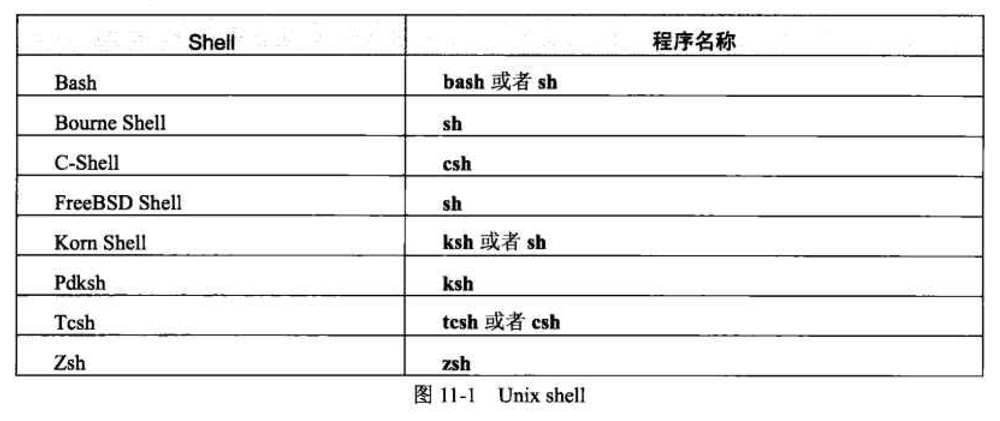

各种Linux系统中的shell名称

``chsh -s /bin/bash username``

用以改变某个用户的默认shell

## 第十二章 使用shell: 变量和选项

shell一般是交互式+非交互式的,当它只是被要求运行一个脚本的时候,就会新启动一个shell,完成之后关闭它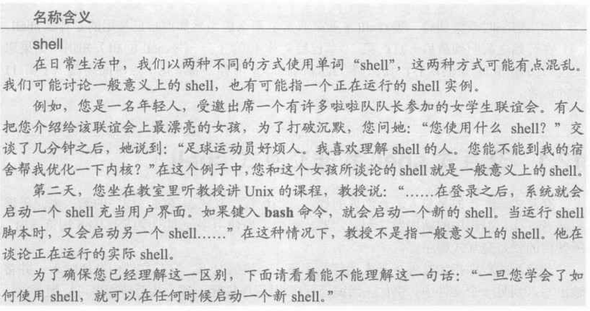

### 环境进程和变量

在shell中可以设置环境变量,一般来说环境变量的特定值就是用来存储字符串的,虽然也能存储数字等等,默认是一个null值.

我们可以从shell中启动一个vi进程,后者就会被称为子进程,子进程和父进程共享同一个**环境变量**, 也就是**全局变量**.

有的shell变量父进程不能传递给子进程用,就被称为**局部变量**.一般有两种用处,用来存放只对shell有用的变量,或是存放临时性的信息或数据.

在Bash类型的shell中:

只有单独的局部变量和既是环境变量又是局部变量这两种情况,如何设置为环境变量,就是赋值结束之后,使用``export``语句,导出,设置为全局变量,都使用纯粹的大写字母表示.

在C-shell中:

小写字母的变量是局部变量,大写的是全局变量,分别使用``set``和``setenv``来表示,其中会选中小部分特别的变量,使大小写相关联,使他们既是局部,又是全局的变量.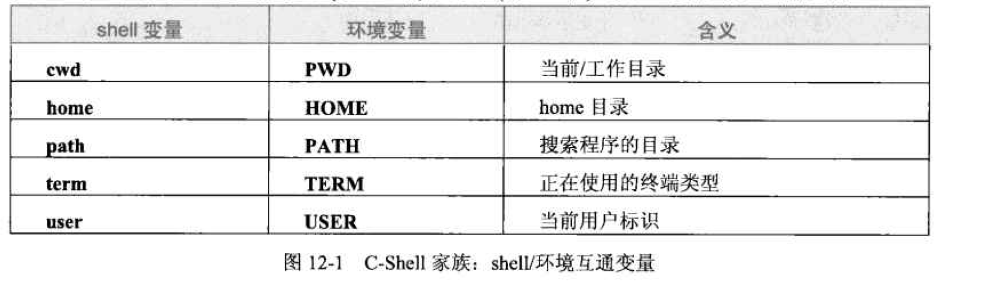

> 为什么他们执着于同时是环境变量和局部变量的东西?为了编程方便?
>
> 如果你在子程序中设置全局变量,在父程序中完全不会改变
>
> 这说明环境变量并不是真正的全局变量,它只能读取,而不能被子程序修改,这一点是为了安全性.
>
> bash的制作者可能是认为环境变量被导出之后,为了维持之前的使用该变量的局部变量形式的程序还可以使用,就默认同时是.而cshell的制作者认为,应该区分清楚,方便管理.
>
> 上面是我猜的.

而env和printenv可以显示环境变量

set则显示所有的shell变量

```bash
echo $TERM
echo The system is $TERM
echo <$TERM>
TERM="a xterm"; export TERM
export TERM="a xterm"
unset TERM
```

echo用来显示环境变量的值,也可以跟一些别的字符串组合,但是变量之前要加上dollar$符号.<>是原语义字符,会直接输出字符串,而不是读取.

unset则是将该变量复位

### shell选项

```bash
set -o monitor
set +o monitor
```

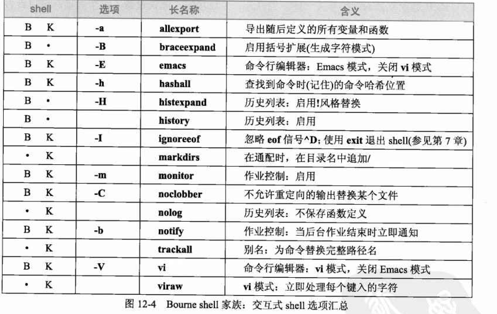

shell -o表示开启,+o表示关闭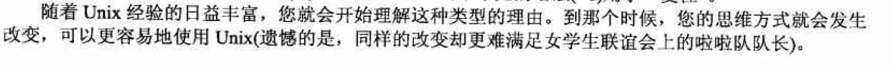

shopt指令可以显示所有的shell选项 

单独的set -o和set +o也可以

一般来说我们需要设置的选项也只有,monitor,ignoreeof,noclobber,emacs,vi


## 第十三章 命令与定制

shell当中分为普通的**数字字母字符(alphanumeric character)**和**元字符(meta character)**两种,后者带有特定的意义,如$, ;等等.

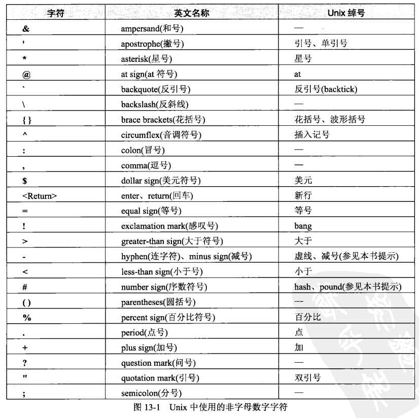

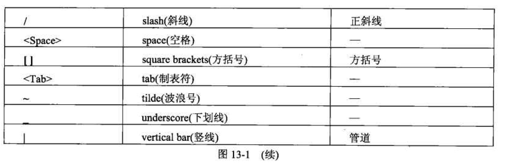

然后下面是一些特定的元字符以及他们的绰号

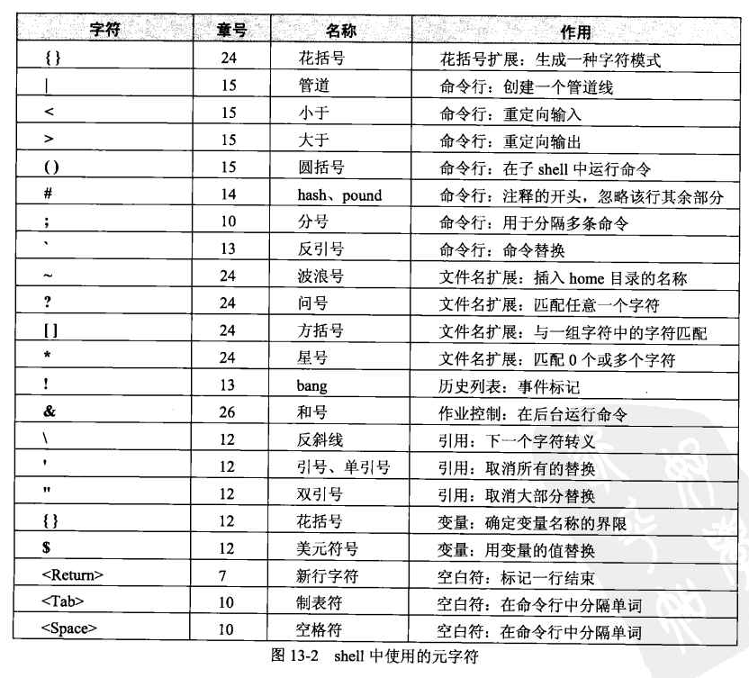

我们可以根据他们的功能简单的分为几类:

引用和转义:

1. 使用反斜线\引用单个字符

2. 使用单引号全部转义

3. 使用双引号,对于$开头的变量,`和\不转义

   另外\给人的感觉其实是类似于escape的功能,它被称之为**转义字符(escape character)**,例如在vi中就通过escape从一种模式切换到另一种模式.

   就层级上来看,单引号是强引用,双引号是弱引用,但是\的等级是最高的,它可以转换单引号甚至是新行符号,所以在一行的末尾按下return,会使下一行接着上一行继续,因为新行符号被转义了,所以不会直接运行,如果你是单引号的话,新行字符就不会被转义,在输出内容里会保留单引号.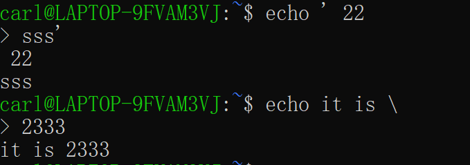

内部命令:

1. 你可以使用type来查看某个指令是内部命令还是外部命令,内部命令没有manual因为被集成在了shell的manual里面
2. 可以通过`` man builtin``或者``help pwd``这样的指令,来查看内部命令的说明

外部命令:

1. 系统会通过环境变量PATH来搜索外部命令,根据环境变量设置的顺序,一个一个寻找,没找到就会输出``command not found``

2. 你可以通过修改PATH环境变量来指定自己的搜索路径,使用命令:

   ``export PATH="/bin:/bin/usr:."``

   不同位置之间使用:分隔,最后一个.表示当前自己的目录

3. 不是很建议系统管理员把.加入PATH,因为这样容易导致黑客伪装ls等基本命令,产生不好的效果

shell提示:

1. 就是命令行最开始那个左手边的标志

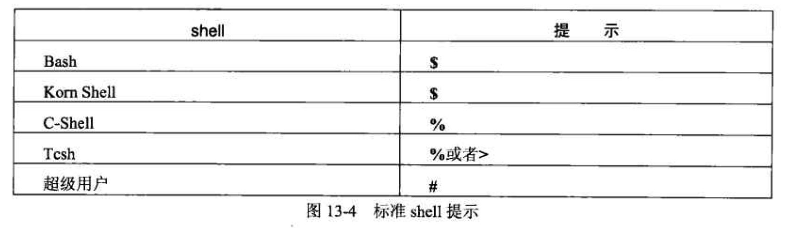

2. 修改shell提示,需要修改一个名为PS1的环境变量

   ` export PS1="$ "`

使用变量:

1. 这是一些基础的可能有用的环境变量,在使用$变量的时候,变量名最好用{}括起来,方便阅读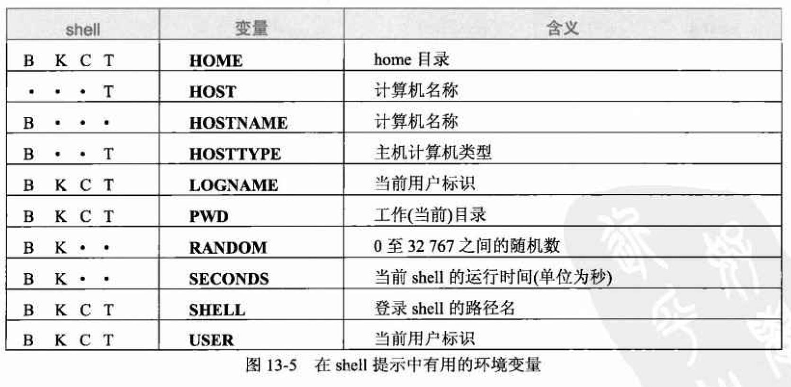

2. 不同引号的作用,单引号会保证不让解释,双引号则会引用变量

   但是当他们赋值到PS1时如下,其实是会改变的:

   ```bash
   export PS1="Lucky number is ${RANDOM} $"
   export PS1='Lucky number is ${RANDOM} $''
   ```

   后者是会随机生成数字的,所以看来提示符并不是简单的一个字符串过去,而是将该命令执行一遍,如果是前者的话,就会生成一个固定的结果,看来是传了一个字符串过去.

3. 命令替换

   事实上你可以在一个命令里,用上另一个命令产生的结果,只需要在特别的命令中加上反引号(backtick)`,请记住,这个和引号没啥关系

   ```bash
   echo "The time and date are `date`."
   export PS1="`basename ${SHELL}` $"
   ```

历史列表:

1. 在shell中有两种方法``history``或者``fc -l``都是可以查看历史记录的

   fc是fix command 的意思

2. 过去的记录也可以快速调用,比如

   ```bash
   !24 ^q^e
   fc -s 24 q=e
   ```

   这两个语法都能起到快速调换的作用,其中24是代码编号

3. 还有一种更加快捷的方式,^R键按了之后,输入一定字符串可以快速检索最近的包含的代码,再按一次^R就可以继续往上搜索,但是遗憾的是,没有替换功能

4. ``export HISTSIZE=50``就可以更改历史记录的长度

5. 一个简单的运用,就比如说在删除文件之前,先用ls查看一遍,然后用替换,把ls替换为rm

6. 有个方法可以在shell提示中显示历史列表的编号

   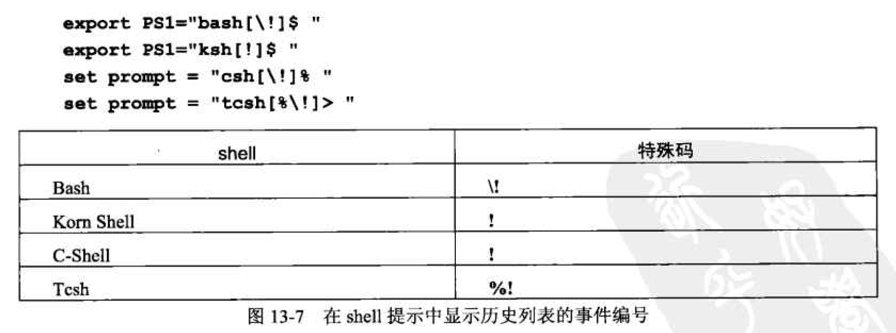

   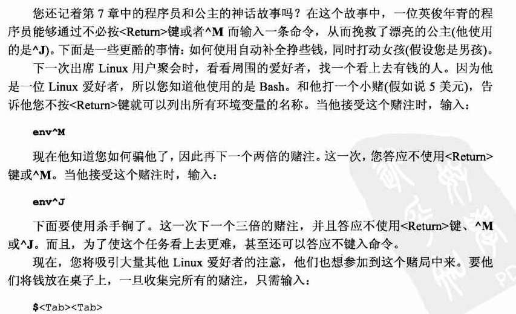

> 这可能是全书目前为止唯一一处真的是段子的地方了,但可惜,只有学会这一章你才能读懂.

别名:

1. alias可以设置别名,形如``alias info='date; uname; who'``

   注意,这里使用单引号,字符串里的内容会保持原样,直至执行

2. ``alias info``可以查询别名

   ``unalias info``可以删除别名

   ``unalias -a``删除全部

3. 有趣的是``type info``会告诉你info是谁的别名

4. 如果你想临时使用程序的正常名字,而不是别名的时候,你只需要在前面悄悄加一个\就可以了,我觉得这其中的原理是\使得第一个字母不必被编译了,自然就不会自动替代,这涉及linux内部的算法,但是这种方式极为简洁明了,在已有程序架构下的解决方案,堪称完美.

5. 养成这样的好习惯,先ls再rm,保证不出错

   所以`` alias del='fc -s ls=rm'``每次ls完之后,只要打一个del就可以了,非常写意

6. 另一个非常方便的东西在于,如果你把别名和history结合在一起的话

   ```bash
   alias r='fc -s'
   ls data*
   r data=template
   r 2 data=template
   r ls
   ```

   这样就特别方便,最后一个可以最快地查询最近的ls开头的命令

## 第十四章 使用shell:初始化文件

### 登录文件与环境文件

一般来说**初始化文件**分为登录文件(login file)和**环境文件**(environment file),前者是登录时运行的,后者是开启一个新的shell时运行的,shell还支持**注销文件(logout file)**.

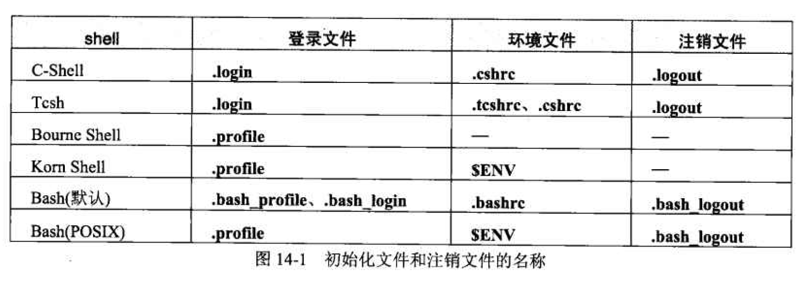

这些文件一般都以.开头,会自动隐藏,需要``ls -a``才能显示出来

而很多文件都会以rc结尾,这样的文件一般是初始化文件,是run command的缩写

登录shell和非登录shell有一些区别:

1. 启用虚拟控制台(Ctrl+Shift+F1)就是开启了一个登录shell
2. 随便开启bash就是非登录shell
3. 使用ssh远程登录就是登录shell

登录shell执行环境文件和登录文件,而非登录shell只执行环境文件,bash首先运行登录文件,然后才是环境文件

登录文件中应该放置的内容:

1. 创建或者修改环境变量的命令
2. 执行所有一次性操作的命令

由于首先运行登录文件,而登录文件中设置的环境变量会被自动继承到子程序shell中,所以环境文件中设置环境变量没有意义(听起来就很搞...那你为啥叫环境文件呢?),它是用来设置不能在环境中保存的自定义项,特别是shell选项,别名和函数,因为没有储存在环境中,所以每一次启动shell的时候都要重新运行一遍.

## 第十五章 标准I/O: 重定向和管道

**标准输入(standard in),标准输出(standard out),标准错误(standard error)**是三个基本的概念,Unix使用标准输出工具,使得代码更为简洁,也就是Less is More.

> 但是作者也有说linux设计的原则有一些不合适的地方:
>
> 1. 首先我们必然会需要一些复杂的工具,比如vi或者emacs
> 2. 其次我们会忍不住创建新的好用的工具,这就导致学习成本很高,不止于一个
> 3. 最后linux执着于命令行,导致无法处理图片数据,这是另一个问题

### 重定向与输出

首先呢,我们来介绍一下 sort命令,他能够将文本文件排序输出(每行),如果你没有标明文件的话就会从键盘的标准输入读取信息并排序输出,^D是终止符号eof.

但是当我们想要导出数据的时候就可以使用标准输出流了:

```bash
sort > address
sort >> address
set -o  noclobber
sort >| address
sort >>| address
sort <rawdata >report
```

'>'标志用来表示输出方向,'>>'则是避免覆盖,在原文件基础上添加

为了避免覆盖误操作,noclobber选项可以提醒你,不要覆盖已有文件,>|可以强制覆盖

最后一条命令,告诉我们输入输出可以同时使用,特别骚

一般来说每一个文件都有一个描述编号,是唯一的数字标识,默认的输入输出标识是0,输出是1,错误是2

``` bash
sort 0<rawdata 1>results 2>error
sort  <rawdata  >results 2>error
```

什么都没写的话就是默认输入与输出,只有error必定要写

在圆括号中书写的代码会自动新开一个子shell来运行,不影响环境变量

如何将标准输出和标准错误重定向到同一个文件中去呢

```bash
sort > output >&1
sort 2> output 1>&2
sort >/dev/null
```

最后一个是抛弃输出流

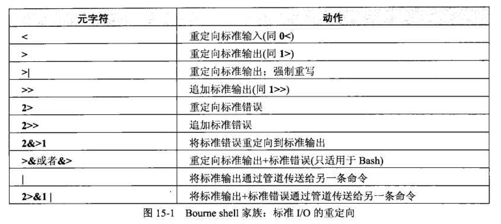

### 管道线

管道线是一个非常有意思的设计,如果一个输入输出流在不同命令之间来回穿梭转换,总是设置一些临时文件是非常麻烦的,使用管道就确保了上一个命令的输出流是下一个文件的输入流,另外也可以把标准错误一起输出

```bash
ls -l file1 file2 | sort
ls -l file1 file2 2>&1 | sort
ls -l file1 file2 | tee file3 file4 | sort
ls -l file1 file2 | tee -a file3 | sort
```

能使用管道线的程序都是过滤器(能读取标准输入,输出标准输出)

tee 是一个专用的分流器,分流到后面的一个或多个文件之后,再管道输出,另外-a就是添加到文件,当然后面没有别的管道的话,就是输出到屏幕了

## 第十六章 过滤器:简介和基本操作

本章介绍了几个最简单的过滤器和他们的使用方法

最有用的过滤器代表

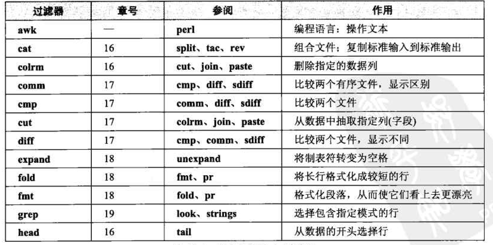

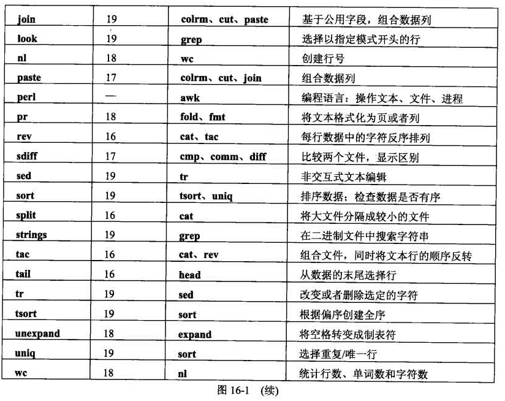

### cat

这可以说是最简单的应用了,它可以从标准输入流或是文件里读取数据,然后输出到屏幕或文件或者下一个管道里,它基本上什么都没做,但是有助于我们在管道中做一些重定向之类的工作

```bash
cat data
cat <data >data1
cat >>data
cat data1 data2
```

最后一个就是能将多个文件组合起来输出

值得注意的是,重定向的输入文件不能作为输出文件,类似于

`` cat name data  > name``

是会报错并把name删除的

1. -n 可以在每行之前加一个行号
2. -b 和-n一起使用,不要在空白行上加行号
3. -s将连续多个空白行压缩为一个

### 划分文件: split

我觉得这个基本就没啥用,把一个大文件分成几个小文件

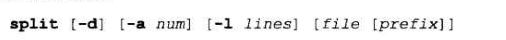

### 逆转文件: tac

其实是tac就是cat反过来,功能相似,只是按照相反的顺序.

这个有的时候很有用,比如你的记录文件log,倒转过来就可以从最新的往最老的看,很方便

```bash
tac log |less
tac log > reverse_log
tac log1 log2 log3 >reverse_log
```

### 反转字符的顺序: rev

这个跟上面差不多,不反转行的顺序,但是反转每一行的字符的顺序

### 从开头到末尾选择数据行: head,tail

他们都是可以接受标准输入输出的,然后显示最开始或者最结尾的n行数据

```bash
head -n 15 data
tail -n 15 data
cat data1 data2 data3 | head -n 200| less
```

### 删除数据列: colrm

删除指定起始列到结束列的列数据

**``colrm [startcol [endcol]]``**

注意对齐啊

诶嘿嘿,我读文档读到的:

1. 上面这个两个方括号的选项啊,就说明第二个可以省略,第一个也可以不写
2. 只有一个数字的话呢,就会从这一列开始删除后面所有的
3. 列的计算从1开始
4. 好像只能使用标准输入流输入数据

## 第十七章 过滤器: 比较和抽取

